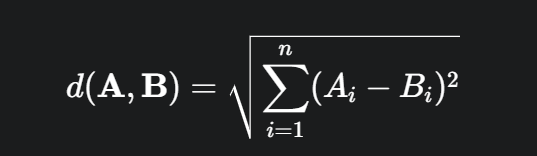
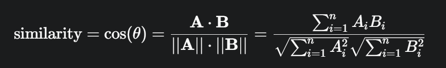

**🔥计算向量相似度的常用方法:**

Comment:这些方法也可以用于衡量最近邻（Nearest Neighbor）

1.欧式距离 (Euclidean Distance):

欧几里得距离是衡量两个向量在多维空间中“直线距离”的方法。距离越小，表示两个向量越相似。

主要的逻辑代码在[Euclidean_Distance.py](Euclidean_Distance.py)

2.内积相似度:

反映了两个向量在空间中的“对齐程度”，内积越大，向量越相似。

3.cosine相似度:

余弦相似度反映了向量之间的夹角大小，余弦相似度越大，向量越相似。

